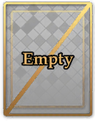
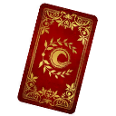

## Full Argument List

### Structure Arguments
Used for setting up the structure of the calculation. How many enemies, which card 
hits who, etc.
 

  
<b> Card</b>

 <table>
  <tr>
    <th>Arg</th>
    <th>Number?</th>
    <th>Decimals?</th>
    <th>Priority</th>
    <th>Duplicate</th>
  </tr>
  <tr>
    <td>card</td>
    <td>✔️</td>
    <td>❌</td>
    <td>N/A</td>
    <td>N/A</td>
</tr>
</table>
All arguments following the card argument will apply only to the specified card until a new card, enemy, or wave
arg is specified. 
The card argument does not define new cards. If you use <code>card6</code> when there are only 5 cards, 
<code>card6</code> and all arguments that would apply to <code>card6</code> will be treated as invalid.
  
Utilizing <code>card0</code> will return you to the global scope.
  
<b>Usage Examples:</b>
 
<code>/calc2 string: Ereshkigal card1 a30 m30 n50</code>
 
This would calculate Ereshkigal's Noble Phantasm, and that card would have 30% ATK Up, 30% Card Up, 
and 50% NP Damage Up.
  
<code>/calc2 string: Ereshkigal bnqe card1 a30 m30 n50 card2 a20 d30 m70</code>
 
This would calculate a Buster➝NP➝Quick➝Extra chain from Ereshkigal. The Buster card would have 
30% ATK Up, 30% Card Up, and 50% NP Damage Up. The Quick card would have 20% ATK Up, 30% Card Up, and 70% NP Damage Up.

  
<b> Enemy</b>

 <table>
  <tr>
    <th>Arg</th>
    <th>Number?</th>
    <th>Decimals?</th>
    <th>Priority</th>
    <th>Duplicate</th>
  </tr>
  <tr>
    <td>enemy</td>
    <td>✔️</td>
    <td>❌</td>
    <td>N/A</td>
    <td>N/A</td>
</tr>
</table>
All arguments following the enemy argument will apply only to the specified enemy until a new card, enemy, or wave
is specified. 
The enemy argument also defines new enemies. If you use <code>enemy3</code> when there are only 2 enemies, 
a new enemy in position 3 will be created.
  
Utilizing <code>enemy0</code> will return you to the global scope.
  
<b>Usage Examples:</b>
 
<code>/calc2 string: Ereshkigal enemy1 saber hp1000</code>
 
This would calculate Ereshkigal's Noble Phantasm against one saber enemy with 1000 HP.
  
<code>/calc2 string: Ereshkigal enemy1 saber hp1000 enemy2 berserker hp5000</code>
 
This would calculate Ereshkigal's Noble Phantasm against one saber enemy with 1000 HP and one 
berserker enemy with 5000 HP. Note that as Ereshkigal's Noble Phantasm is AoE, it would hit both by default.
  
<code>/calc2 string: Ereshkigal enemy1 m40 d-30 enemy2 m60 d-20</code>
 
This would calculate Ereshkigal's Noble Phantasm against two enemies. When hitting the first enemy, 
the Noble Phantasm will have 40% Card Up and 30% Defense Down. When hitting the second enemy, 
the Noble Phantasm will have 60% Card Up and 20% Defense Down.
  
<code>/calc2 string: Ereshkigal buster enemy1 m40 d-30 enemy2 m60 d-20</code>
 
This would calculate a Buster card from Ereshkigal. Two enemies are specified, but since normal 
cards can only hit one enemy, it would only hit <code>enemy1</code>. The Buster card would have
40% Card Up and 30% Defense Down.

  
<b> E</b>

 <table>
  <tr>
    <th>Arg</th>
    <th>Number?</th>
    <th>Decimals?</th>
    <th>Priority</th>
    <th>Duplicate</th>
  </tr>
  <tr>
    <td>e</td>
    <td>✔️</td>
    <td>❌</td>
    <td>N/A</td>
    <td>N/A</td>
</tr>
</table>
Used for targeting enemies with a card. If provided after a card, the card will only hit
the specified enemy. For AoE Noble Phantasms, multiple <code>e</code> args can be specified.
  
The <code>e</code> argument can only be used if provided after first explicitly switching to a card.
  
If an invalid enemy is provided, the argument will be ignored. Ex. if there are only 2 enemies, 
<code>e3</code> will be ignored.
  
<b>Usage Examples:</b>
 
<code>/calc2 string: Ereshkigal nwave1 card1 e1</code>
 
This would calculate Ereshkigal's Noble Phantasm against a wave defined with 3 enemies, but 
the Noble Phantasm would only actually hit <code>enemy1</code>.
  
<code>/calc2 string: Ereshkigal bqa nwave1 card1 e1 card2 e2 card3 e3</code>
 
This would calculate a Buster➝Quick➝Arts chain from Ereshkigal against a wave defined with 3 enemies.
The Buster card would hit <code>enemy1</code>, the Quick card would hit <code>enemy2</code>, and 
the Arts card would hit <code>enemy3</code>.
  
<code>/calc2 string: Ereshkigal npbb enemy1 enemy2 card2 e2 card3 e2</code>
 
This would calculate an NP➝Buster➝Buster chain from Ereshkigal against two enemies.
The Noble Phantasm will hit both enemies, but the Buster cards will only hit <code>enemy2</code>.
  
<code>/calc2 string: Ereshkigal nwave1 card1 e1 e2</code>
 
This would calculate Ereshkigal's Noble Phantasm against a wave defined with 3 enemies, but the 
Noble Phantasm would only hit <code>enemy1</code> and <code>enemy2</code>.

  
<b> Wave</b>

 <table>
  <tr>
    <th>Arg</th>
    <th>Number?</th>
    <th>Decimals?</th>
    <th>Priority</th>
    <th>Duplicate</th>
  </tr>
  <tr>
    <td>wave</td>
    <td>✔️</td>
    <td>❌</td>
    <td>N/A</td>
    <td>N/A</td>
</tr>
</table>
All arguments following the wa argument will apply only to the specified wave until a new card, enemy, or wave 
arg is specified. 
 
The wave argument does not define new waves. If you use <code>wave2</code> when there is only one wave, 
<code>wave2</code> and all arguments that would apply to <code>wave2</code> will be treated as invalid.
  
Waves are automatically generated based on the number of enemies and the value of <code>wavesize</code> (3 by default).
In the calc <code>/calc2 string: Ereshkigal enemy1 enemy2 enemy3 enemy4</code>, <code>wave1</code> and 
<code>wave2</code> would be valid, with <code>wave1</code> containing enemies 1-3 and <code>wave2</code> 
containing enemy 4.
  
Utilizing <code>wave0</code> will return you to the general scope.
  
<b>Usage Examples:</b>
 
<code>/calc2 string: Ereshkigal enemy1 enemy2 wave1 m30</code>
 
This would calculate Ereshkigal's Noble Phantasm against two enemies. When hitting both 
enemies, the Noble Phantasm would have 30% Card Up.
  
<code>/calc2 string: Ereshkigal npnp nwave1 nwave2 wave1 m30 wave2 m60 card1 w1 card2 w2</code>
 
This would calculate two Noble Phantasms from Ereshkigal. The first Noble Phantasm would only hit <code>wave1</code>,
and would have 30% Card Up. The second Noble Phantasm would only hit <code>wave2</code>, and would have 60% Card Up.

  
<b> NewWave / NWave</b>

 <table>
  <tr>
    <th>Arg</th>
    <th>Number?</th>
    <th>Decimals?</th>
    <th>Priority</th>
    <th>Duplicate</th>
  </tr>
  <tr>
    <td>newwave nwave</td>
    <td>✔️</td>
    <td>❌</td>
    <td>N/A</td>
    <td>N/A</td>
</tr>
</table>
The newwave argument is used to define and switch to entire waves at once. It is equivalent to specifying
<code>enemy#</code> for each enemy that would be in a given wave, followed by <code>wave#</code> for the 
corresponding wave.
  
For example, say that you use <code>nwave3</code> with a <code>wavesize</code> of the default 
3. If each wave is 3 enemies, that would mean a third wave would contain enemies 7, 8, and 9.
In this scenario, <code>nwave3</code> would be equivalent to <code>enemy7 enemy8 enemy9 wave3</code>.
  
In the scenario that you specify an already existing wave, <code>nwave</code> will fill out 
the remaining enemies in that wave until it has the same number of enemies as 
<code>wavesize</code>.
  
Utilizing <code>nwave0</code> will return you to the general scope.
  
<b>Usage Examples:</b>
 
<code>/calc2 string: Ereshkigal nwave1 m30</code>
 
This would calculate Ereshkigal's Noble Phantasm against a wave of 3 enemies. When hitting any of the enemies, 
the Noble Phantasm would have 30% Card Up.

  
<b> W</b>

 <table>
  <tr>
    <th>Arg</th>
    <th>Number?</th>
    <th>Decimals?</th>
    <th>Priority</th>
    <th>Duplicate</th>
  </tr>
  <tr>
    <td>w</td>
    <td>✔️</td>
    <td>❌</td>
    <td>N/A</td>
    <td>N/A</td>
</tr>
</table>
Used for targeting waves with a card. If provided after a card, the card will only hit
the specified wave. For an AoE Noble Phantasm, this means that it will hit all enemies in the wave.
For a normal card, it will hit the first enemy in the wave.
  
The <code>w</code> argument can only be used if provided after first explicitly switching to a card.
  
If an invalid wave is provided, the argument will be ignored. Ex. if there are only 2 waves, 
<code>w3</code> will be ignored.
  
<b>Usage Examples:</b>
 
<code>/calc2 string: Ereshkigal nwave1 nwave2 card1 w2</code>
 
This would calculate Ereshkigal's Noble Phantasm against <code>wave2</code> of enemies. Two full waves 
are defined using <code>nwave</code>, and since the Phantasm is AoE, it will hit 
<code>enemy4</code>, <code>enemy5</code>, and <code>enemy6</code>.
  
<code>/calc2 string: Ereshkigal nwave1 nwave2 buster card1 w2</code>
 
This would calculate Ereshkigal's Buster card against <code>enemy4</code>. This is because two waves of 3 enemies 
are defined using <code>nwave</code>, and the buster card will only hit the first enemy of <code>wave2</code> when 
using <code>w2</code> as a target. The first enemy of <code>wave2</code> is <code>enemy4</code>.
  

<b> WaveSize</b>

 <table>
  <tr>
    <th>Arg</th>
    <th>Number?</th>
    <th>Decimals?</th>
    <th>Priority</th>
    <th>Duplicate</th>
  </tr>
  <tr>
    <td>wavesize</td>
    <td>✔️ (1-6)</td>
    <td>❌</td>
    <td>N/A</td>
    <td>N/A</td>
</tr>
</table>
Used to specify the number of enemies per wave, 1-6. In practice, unless you really know what you're doing and 
why you're doing it, this should <b>only</b> ever be used for battles with 6 enemy waves.
  
Note that this argument neither creates enemies nor waves. It is only used to indicate how many enemies should be 
allowed in a wave, and consequently how to split the enemies already provided.
  
By default, <code>/calc2 string: Ereshkigal enemy1 enemy4</code> would create two waves with one enemy each.
If you were to specify <code>wavesize4</code> however, it would create one wave with two enemies.
  
Please note that <code>wavesize</code> is global. You cannot specify a different <code>wavesize</code> 
for different waves. With that said, you don't need to. You can still make a three enemy wave even if 
<code>wavesize</code> is 6 by simply manually creating the enemies.
  
<b>Usage Examples:</b>
 
<code>/calc2 string: Ereshkigal wavesize6 nwave1</code>
 
This would set the number of enemies per wave to 6 and create one wave of 6 enemies.
  
<code>/calc2 string: Ereshkigal wavesize6 nwave1 enemy7 enemy8 enemy9</code>
 
This would create one wave of 6 enemies (<code>nwave1</code>) and a second wave of three enemies 
(<code>enemy7 enemy8 enemy9</code>).
  
<code>/calc2 string: Ereshkigal wavesize6 enemy1 enemy2 enemy3 nwave2</code>
 
This would create one wave of three enemies (<code>enemy1 enemy2 enemy3</code>) and a second wave
of 6 enemies (<code>nwave2</code>). Note that the wave of 6 enemies will begin with <code>enemy7</code> and end with 
<code>enemy12,</code> as <code>wavesize</code> is 6 so any enemies prior to 7 would be part of 
<code>wave1</code> and thus not a new wave.

  
<b>🎲 RNG / Rand / Random</b>

 <table>
  <tr>
    <th>Arg</th>
    <th>Number?</th>
    <th>Decimals?</th>
    <th>Priority</th>
    <th>Duplicate</th>
  </tr>
  <tr>
    <td>rng rand random</td>
    <td>✔️</td>
    <td>️️✔️</td>
    <td>N/A</td>
    <td>Ignore</td>
</tr>
</table>
Used to provide a custom RNG value as opposed to the default range of 
<code>0.9</code>, <code>1.0</code>, and <code>1.099</code>. Note that only one custom RNG value 
can be provided. Subsequent values will be ignored.
  
<b>Usage Examples:</b>
 
<code>/calc2 string: Ereshkigal rng1.077</code>
 
This would calculate Ereshkigal's Noble Phantasm with an RNG value of <code>1.077</code>.
  
<code>/calc2 string: Ereshkigal bb rng1.077</code>
 
This would calculate two of Ereshkigal's Buster Cards, each with an RNG value of <code>1.077</code>.

### Card Arguments
Used to tell EreshBot which cards to calculate.
 

  
<b> Buster / B</b>

 <table>
  <tr>
    <th>Arg</th>
    <th>Number?</th>
    <th>Decimals?</th>
    <th>Priority</th>
    <th>Duplicate</th>
  </tr>
  <tr>
    <td>buster b</td>
    <td>❌</td>
    <td>❌</td>
    <td>N/A</td>
    <td>N/A</td>
</tr>
</table>
Used to tell EreshBot to calculate a Buster card.
  
<b>Usage Examples:</b>
 
<code>/calc2 string: Ereshkigal buster</code>
 
This would calculate one Buster card from Ereshkigal.
  
<code>/calc2 string: Ereshkigal buster buster</code>
 
This would calculate two Buster cards from Ereshkigal.
  
<code>/calc2 string: Ereshkigal b</code>
 
This would calculate one Buster card from Ereshkigal.
  
<code>/calc2 string: Ereshkigal bb</code>
 
This would calculate two Buster cards from Ereshkigal.

  
<b> Arts / A</b>

 <table>
  <tr>
    <th>Arg</th>
    <th>Number?</th>
    <th>Decimals?</th>
    <th>Priority</th>
    <th>Duplicate</th>
  </tr>
  <tr>
    <td>arts a</td>
    <td>❌</td>
    <td>❌</td>
    <td>N/A</td>
    <td>N/A</td>
</tr>
</table>
Used to tell EreshBot to calculate an Arts card.
  
<b>Usage Examples:</b>
 
<code>/calc2 string: Ereshkigal arts</code>
 
This would calculate one Arts card from Ereshkigal.
  
<code>/calc2 string: Ereshkigal arts arts</code>
 
This would calculate two Arts cards from Ereshkigal.
  
<code>/calc2 string: Ereshkigal a</code>
 
This would calculate one Arts card from Ereshkigal.
  
<code>/calc2 string: Ereshkigal aa</code>
 
This would calculate two Arts cards from Ereshkigal.

  
<b> Quick / Q</b>

 <table>
  <tr>
    <th>Arg</th>
    <th>Number?</th>
    <th>Decimals?</th>
    <th>Priority</th>
    <th>Duplicate</th>
  </tr>
  <tr>
    <td>quick q</td>
    <td>❌</td>
    <td>❌</td>
    <td>N/A</td>
    <td>N/A</td>
</tr>
</table>
Used to tell EreshBot to calculate a Quick card.
  
<b>Usage Examples:</b>
 
<code>/calc2 string: Ereshkigal quick</code>
 
This would calculate one Quick card from Ereshkigal.
      
<code>/calc2 string: Ereshkigal quick quick</code>
 
This would calculate two Quick cards from Ereshkigal.
  
<code>/calc2 string: Ereshkigal q</code>
 
This would calculate one Quick card from Ereshkigal.
  
<code>/calc2 string: Ereshkigal qq</code>
 
This would calculate two Quick cards from Ereshkigal.

  
<b> Extra / E</b>

 <table>
  <tr>
    <th>Arg</th>
    <th>Number?</th>
    <th>Decimals?</th>
    <th>Priority</th>
    <th>Duplicate</th>
  </tr>
  <tr>
    <td>extra e</td>
    <td>❌</td>
    <td>❌</td>
    <td>N/A</td>
    <td>N/A</td>
</tr>
</table>
Used to tell EreshBot to calculate an Extra card.
  
<b>Usage Examples:</b>
 
<code>/calc2 string: Ereshkigal extra</code>
 
This would calculate one Extra card from Ereshkigal.
  
<code>/calc2 string: Ereshkigal extra extra</code>
 
This would calculate two Extra cards from Ereshkigal.
  
<code>/calc2 string: Ereshkigal e</code>
 
This would calculate one Extra card from Ereshkigal.
  
<code>/calc2 string: Ereshkigal ee</code>
 
This would calculate two Extra cards from Ereshkigal.

  
<b> Noble / NP / N</b>

 <table>
  <tr>
    <th>Arg</th>
    <th>Number?</th>
    <th>Decimals?</th>
    <th>Priority</th>
    <th>Duplicate</th>
  </tr>
  <tr>
    <td>noble np n</td>
    <td>❌</td>
    <td>❌</td>
    <td>N/A</td>
    <td>N/A</td>
</tr>
</table>
Used to tell EreshBot to calculate a Noble Phantasm card.
  
<b>Usage Examples:</b>
 
<code>/calc2 string: Ereshkigal np</code>
 
This would calculate one Noble Phantasm card from Ereshkigal.
  
<code>/calc2 string: Ereshkigal npnp</code>
 
This would calculate two Noble Phantasm cards from Ereshkigal.
  
<code>/calc2 string: Ereshkigal n</code>
 
This would calculate one Noble Phantasm card from Ereshkigal.
  
<code>/calc2 string: Ereshkigal nn</code>
 
This would calculate two Noble Phantasm cards from Ereshkigal.

  
<b> X</b>

 <table>
  <tr>
    <th>Arg</th>
    <th>Number?</th>
    <th>Decimals?</th>
    <th>Priority</th>
    <th>Duplicate</th>
  </tr>
  <tr>
    <td>x</td>
    <td>❌</td>
    <td>❌</td>
    <td>N/A</td>
    <td>N/A</td>
</tr>
</table>
Used to tell EreshBot to calculate skip a card while including it within a chain.
Useful for cases such as <code>/calc2 string: Ereshkigal bxb</code> where you still want
the third card to be in position 3, even if you aren't calculating a second card.
  
<b>Usage Examples:</b>
 
<code>/calc2 string: Ereshkigal bxb</code>
 
This would calculate one two Buster cards from Ereshkigal, with the first card in position 1 and the second card
in position 3.

<b>☆ Important Note:</b>
 
The <code>np</code>, <code>n</code>, and <code>e</code> arguments do different things depending on whether or not 
you include a number with them.

More Details

<code>np#</code>: Sets NP level.
 
<code>np</code>: Card argument for NP.

<code>n#</code>: Sets NP damage.
 
<code>n</code>: Card argument for NP.

<code>e#</code>: Sets target enemy for a card.
 
<code>e</code>: Card argument for Extra.
 

### Servant Attribute Arguments
Used to indicate the specifics of your servant, such as NP level, CE Attack, etc.
 

  
<b> Level / Lvl / Lv / L</b>

 <table>
  <tr>
    <th>Arg</th>
    <th>Number?</th>
    <th>Decimals?</th>
    <th>Priority</th>
    <th>Duplicate</th>
  </tr>
  <tr>
    <td>level lvl lv l</td>
    <td>✔️</td>
    <td>❌</td>
    <td>N/A</td>
    <td>Replace</td>
</tr>
</table>
Used to indicate the level of your servant. Servant's base attack is automatically set based on level.
  
<b>Usage Examples:</b>
 
<code>/calc2 string: Ereshkigal lv50</code>
 
This would calculate Ereshkigal's Noble Phantasm with an attack stat based on Ereshkigal's attack at level 50.

  
<b> NPLevel / NP</b>

 <table>
  <tr>
    <th>Arg</th>
    <th>Number?</th>
    <th>Decimals?</th>
    <th>Priority</th>
    <th>Duplicate</th>
  </tr>
  <tr>
    <td>nplevel np</td>
    <td>✔️</td>
    <td>❌</td>
    <td>N/A</td>
    <td>Replace</td>
</tr>
</table>
Used to tell EreshBot what the NP level of your servant is.
  
<b>Usage Examples:</b>
 
<code>/calc2 string: Ereshkigal np3</code>
 
This would calculate a Noble Phantasm from Ereshkigal at NP level 3.

  
<b> Strengthen / STR / Lewd / Interlude / SetNP / SNP</b>

 <table>
  <tr>
    <th>Arg</th>
    <th>Number?</th>
    <th>Decimals?</th>
    <th>Priority</th>
    <th>Duplicate</th>
  </tr>
  <tr>
    <td>np</td>
    <td>✔️</td>
    <td>❌</td>
    <td>N/A</td>
    <td>Replace</td>
</tr>
</table>
Used to tell EreshBot what the strengthening status of your servant is.
 
This argument is also used to switch between Noble Phantasms for servants like Space Ishtar 
or Fairy Knight Lancelot.
 
Noble Phantasms are numbered starting from 0 in the same order they appear in <code>/np Servant</code>.
  
<b>Usage Examples:</b>
 
<code>/calc2 string: Ereshkigal str1</code>
 
This would calculate Ereshkigal's upgraded Noble Phantasm.
  
<code>/calc2 string: Bride str0</code>
 
This would calculate Nero Bride's un-upgraded Noble Phantasm.
  
<code>/calc2 string: Vlad str2</code>
 
This would calculate Vlad III's Noble Phantasm with its <i>second</i> strengthening.
  
<code>/calc2 string: Spishtar str1</code>
 
This would calculate Space Ishtar's Buster Noble Phantasm.

  
<b> Fou / F</b>

 <table>
  <tr>
    <th>Arg</th>
    <th>Number?</th>
    <th>Decimals?</th>
    <th>Priority</th>
    <th>Duplicate</th>
  </tr>
  <tr>
    <td>fou f</td>
    <td>✔️</td>
    <td>❌</td>
    <td>E>C>W>G</td>
    <td>Replace</td>
</tr>
</table>
Used to indicate how much additional ATK stat your servant should have from ATK fous.
  
<b>Usage Examples:</b>
 
<code>/calc2 string: Ereshkigal fou2000</code>
 
This would calculate Ereshkigal's Noble Phantasm with 2,000 additional ATK from fous.

  
<b> Paw / FouPaw / Print / Footprint</b>

 <table>
  <tr>
    <th>Arg</th>
    <th>Number?</th>
    <th>Decimals?</th>
    <th>Priority</th>
    <th>Duplicate</th>
  </tr>
  <tr>
    <td>paw foupaw print footprint</td>
    <td>✔️</td>
    <td>❌</td>
    <td>E>C>W>G</td>
    <td>Replace</td>
</tr>
</table>
Used to indicate how much additional ATK stat your servant should have from fou paws.
  
<b>Usage Examples:</b>
 
<code>/calc2 string: Ereshkigal buster paw250</code>
 
This would calculate Ereshkigal's Buster card with 250 additional ATK from fou paws.

  
<b> CE / C</b>

 <table>
  <tr>
    <th>Arg</th>
    <th>Number?</th>
    <th>Decimals?</th>
    <th>Priority</th>
    <th>Duplicate</th>
  </tr>
  <tr>
    <td>ce c</td>
    <td>✔️</td>
    <td>❌</td>
    <td>E>C>W>G</td>
    <td>Replace</td>
</tr>
</table>
Used to indicate how much additional ATK stat your servant should have from a craft essence.
  
<b>Usage Examples:</b>
 
<code>/calc2 string: Ereshkigal ce2000</code>
 
This would calculate Ereshkigal's Noble Phantasm with 2,000 additional ATK from a craft essence.

  
<b> TotalAttack / TA</b>

 <table>
  <tr>
    <th>Arg</th>
    <th>Number?</th>
    <th>Decimals?</th>
    <th>Priority</th>
    <th>Duplicate</th>
  </tr>
  <tr>
    <td>totalattack ta</td>
    <td>✔️</td>
    <td>❌</td>
    <td>E>C>W>G</td>
    <td>Replace</td>
</tr>
</table>
Used to specify the total attack stat of your servant. This will override all other sources of ATK.
 
In other words, if you specify total attack, then fou, ce, paw, and the servant's base attack will all be 
ignored and replaced by your specified total attack.
  
<b>Usage Examples:</b>
 
<code>/calc2 string: Ereshkigal ta11525</code>
 
This would calculate Ereshkigal's Noble Phantasm with 11,525 ATK stat.

### Card Attribute Arguments
Used to specify things like buster first bonus, whether a card critically hits, etc.
 

  
<b>1️⃣ First</b>

 <table>
  <tr>
    <th>Arg</th>
    <th>Number?</th>
    <th>Decimals?</th>
    <th>Priority</th>
    <th>Duplicate</th>
  </tr>
  <tr>
    <td>first</td>
    <td>❌</td>
    <td>❌</td>
    <td>E>C>W>G</td>
    <td>Replace</td>
</tr>
</table>
Used to indicate that a given card should be in position 1. Using this argument will automatically
apply the first card bonus for the card type.
  
Note that this argument will not affect cards in card chains.
  
<b>Usage Examples:</b>
 
<code>/calc2 string: Ereshkigal buster first</code>
 
This would calculate one of Ereshkigal's Buster cards in position 1.

  
<b>2️⃣ Second</b>

 <table>
  <tr>
    <th>Arg</th>
    <th>Number?</th>
    <th>Decimals?</th>
    <th>Priority</th>
    <th>Duplicate</th>
  </tr>
  <tr>
    <td>second</td>
    <td>❌</td>
    <td>❌</td>
    <td>E>C>W>G</td>
    <td>Replace</td>
</tr>
</table>
Used to indicate that a given card should be in position 2.
  
Note that this argument will not affect cards in card chains.
  
<b>Usage Examples:</b>
 
<code>/calc2 string: Ereshkigal buster second</code>
 
This would calculate one of Ereshkigal's Buster cards in position 2.

  
<b>3️⃣ Third</b>

 <table>
  <tr>
    <th>Arg</th>
    <th>Number?</th>
    <th>Decimals?</th>
    <th>Priority</th>
    <th>Duplicate</th>
  </tr>
  <tr>
    <td>third</td>
    <td>❌</td>
    <td>❌</td>
    <td>E>C>W>G</td>
    <td>Replace</td>
</tr>
</table>
Used to indicate that a given card should be in position 3.
  
Note that this argument will not affect cards in card chains.
  
<b>Usage Examples:</b>
 
<code>/calc2 string: Ereshkigal buster third</code>
 
This would calculate one of Ereshkigal's Buster cards in position 3.

  
<b> BusterFirst / BF</b>

 <table>
  <tr>
    <th>Arg</th>
    <th>Number?</th>
    <th>Decimals?</th>
    <th>Priority</th>
    <th>Duplicate</th>
  </tr>
  <tr>
    <td>busterfirst bf</td>
    <td>❌</td>
    <td>❌</td>
    <td>E>C>W>G</td>
    <td>Replace</td>
</tr>
</table>
This argument can be used to force buster first card bonus even in cases where a buster card is not 
first and/or you are calculating a single non-buster card.
 
Note that when calculating a single buster card or using a card chain that begins with a buster card,
this bonus is automatically applied.
  
<b>Usage Examples:</b>
 
<code>/calc2 string: Ereshkigal quick bf</code>
 
This would calculate a quick card from Ereshkigal with buster first bonus.
  
<code>/calc2 string Ereshkigal xqbe bf</code>
 
This would calculate an X→Quick→Buster→Extra card chain from Ereshkigal with buster first bonus.
This could be useful if the x card is a different servant's buster card.

  
<b> ArtsFirst / AF</b>

 <table>
  <tr>
    <th>Arg</th>
    <th>Number?</th>
    <th>Decimals?</th>
    <th>Priority</th>
    <th>Duplicate</th>
  </tr>
  <tr>
    <td>artsfirst af</td>
    <td>❌</td>
    <td>❌</td>
    <td>E>C>W>G</td>
    <td>Replace</td>
</tr>
</table>
This argument can be used to force arts first card bonus even in cases where an arts card is not 
first and/or you are calculating a single non-arts card.
 
Note that when calculating a single arts card or using a card chain that begins with an arts card,
this bonus is automatically applied.
  
<b>Usage Examples:</b>
 
<code>/calc2 string: Ereshkigal quick af</code>
 
This would calculate a quick card from Ereshkigal with arts first bonus.
  
<code>/calc2 string Ereshkigal xqbe af</code>
 
This would calculate an X→Quick→Buster→Extra card chain from Ereshkigal with arts first bonus.
This could be useful if the x card is a different servant's arts card.

  
<b> QuickFirst / QF</b>

 <table>
  <tr>
    <th>Arg</th>
    <th>Number?</th>
    <th>Decimals?</th>
    <th>Priority</th>
    <th>Duplicate</th>
  </tr>
  <tr>
    <td>quickfirst qf</td>
    <td>❌</td>
    <td>❌</td>
    <td>E>C>W>G</td>
    <td>Replace</td>
</tr>
</table>
This argument can be used to force quick first card bonus even in cases where a quick card is not 
first and/or you are calculating a single non-quick card.
 
Note that when calculating a single quick card or using a card chain that begins with a quick card,
this bonus is automatically applied.
  
<b>Usage Examples:</b>
 
<code>/calc2 string: Ereshkigal arts qf</code>
 
This would calculate an arts card from Ereshkigal with quick first bonus.
  
<code>/calc2 string Ereshkigal xabe qf</code>
 
This would calculate an X→Arts→Buster→Extra card chain from Ereshkigal with quick first bonus.
This could be useful if the x card is a different servant's quick card.

  
<b> BusterChain / BC</b>

 <table>
  <tr>
    <th>Arg</th>
    <th>Number?</th>
    <th>Decimals?</th>
    <th>Priority</th>
    <th>Duplicate</th>
  </tr>
  <tr>
    <td>busterchain bc</td>
    <td>❌</td>
    <td>❌</td>
    <td>E>C>W>G</td>
    <td>Replace</td>
</tr>
</table>
This argument can be used to force a buster chain bonus even when calculating a single card.
 
Note that when calculating a buster card chain using card arguments, this is automatically applied.
 
Additionally, using this argument will automatically apply buster first.
  
<b>Usage Examples:</b>
 
<code>/calc2 string: Ereshkigal buster bc</code>
 
This would calculate a single Buster card from Ereshkigal as a part of a buster chain.

  
<b> ArtsChain / AC</b>

 <table>
  <tr>
    <th>Arg</th>
    <th>Number?</th>
    <th>Decimals?</th>
    <th>Priority</th>
    <th>Duplicate</th>
  </tr>
  <tr>
    <td>artschain ac</td>
    <td>❌</td>
    <td>❌</td>
    <td>E>C>W>G</td>
    <td>Replace</td>
</tr>
</table>
This argument can be used to force an arts chain bonus even when calculating a single card.
 
Note that when calculating an arts card chain using card arguments, this is automatically applied.
 
Additionally, using this chain argument will automatically apply arts first.
  
<b>Usage Examples:</b>
 
<code>/calc2 string: Ereshkigal arts ac</code>
 
This would calculate a single Arts card from Ereshkigal as a part of an arts chain.

  
<b> QuickChain / QC</b>

 <table>
  <tr>
    <th>Arg</th>
    <th>Number?</th>
    <th>Decimals?</th>
    <th>Priority</th>
    <th>Duplicate</th>
  </tr>
  <tr>
    <td>quickchain qc</td>
    <td>❌</td>
    <td>❌</td>
    <td>E>C>W>G</td>
    <td>Replace</td>
</tr>
</table>
This argument can be used to force a quick chain bonus even when calculating a single card.
 
Note that when calculating a quick card chain using card arguments, this is automatically applied.
 
Additionally, using this argument will automatically apply quick first.
  
<b>Usage Examples:</b>
 
<code>/calc2 string: Ereshkigal quick qc</code>
 
This would calculate a single Quick card from Ereshkigal as a part of a quick chain.

  
<b> ExtraCardModifier / ECM</b>

 <table>
  <tr>
    <th>Arg</th>
    <th>Number?</th>
    <th>Decimals?</th>
    <th>Priority</th>
    <th>Duplicate</th>
  </tr>
  <tr>
    <td>extracardmodifier ecm</td>
    <td>✔️</td>
    <td>✔️</td>
    <td>E>C>W>G</td>
    <td>Replace</td>
</tr>
</table>
This argument can be used to set a custom extra card modifier. Note that this argument only impacts extra cards.
 
When calculating using card chains, the extra card modifier is automatically applied with the appropriate amount.
  
Note: This value is 1 by default, 2 if the extra card is part of a brave chain, and 3.5 if the extra card is
part of a color brave chain (ex. bbbe). Note that in FGO, generally you cannot use an extra card in any other scenario 
than as a part of a brave chain, so in practice this value should <b>always</b> be 2.0 or 3.5.
  
<b>Usage Examples:</b>
 
<code>/calc2 string: Ereshkigal extra ecm2</code>
 
This would calculate an extra card from Ereshkigal with an extra card modifier of 2.
  
<code>/calc2 string Ereshkigal extra ecm3.5</code>
 
This would calculate an extra card from Ereshkigal with an extra card modifier of 3.5.

  
<b> NoBusterFirst / NoBF / No-BF</b>

 <table>
  <tr>
    <th>Arg</th>
    <th>Number?</th>
    <th>Decimals?</th>
    <th>Priority</th>
    <th>Duplicate</th>
  </tr>
  <tr>
    <td>nobusterfirst nobf no-bf</td>
    <td>❌</td>
    <td>❌</td>
    <td>E>C>W>G</td>
    <td>Replace</td>
</tr>
</table>
This argument can be used to force remove the buster first card bonus even when calculating a single 
buster card or a card chain beginning with a buster card.
 
As far as I am aware, this is impossible for the player, but when calculating an enemy's cards, this can be applied.
  
<b>Usage Examples:</b>
 
<code>/calc2 string: Ereshkigal buster nobf</code>
 
This would calculate a single buster card from Ereshkigal without buster first bonus.
  
<code>/calc2 string Ereshkigal bbb bf</code>
 
This would calculate an Buster→Buster→Buster→Extra card chain from Ereshkigal without buster first bonus.

  
<b> Critical / Crit</b>

 <table>
  <tr>
    <th>Arg</th>
    <th>Number?</th>
    <th>Decimals?</th>
    <th>Priority</th>
    <th>Duplicate</th>
  </tr>
  <tr>
    <td>critical crit</td>
    <td>❌</td>
    <td>❌</td>
    <td>E>C>W>G</td>
    <td>Replace</td>
</tr>
</table>
This argument indicates that a card is a critical hit.
  
<b>Usage Examples:</b>
 
<code>/calc2 string: Ereshkigal quick critical</code>
 
This would calculate a single Quick card from Ereshkigal, and that card would be a critical hit.

  
<b> NPOverride / NPValue / NPV / NPO</b>

 <table>
  <tr>
    <th>Arg</th>
    <th>Number?</th>
    <th>Decimals?</th>
    <th>Priority</th>
    <th>Duplicate</th>
  </tr>
  <tr>
    <td>npoverride npvalue npv npo</td>
    <td>✔️</td>
    <td>✔️</td>
    <td>E>C>W>G</td>
    <td>Replace</td>
</tr>
</table>
This argument can be used to set a custom np multiplier. This can be used to calculate very new NP before EreshBot 
updates.
  
This corresponds to <code>npDamageMultiplier</code> in the damage formula.
  
<b>Usage Examples:</b>
 
<code>/calc2 string: Ereshkigal npv550</code>
 
This would calculate Ereshkigal's noble phantasm with a custom multiplier of 550%.

  
<b> CardDamageVal / CDV / CardValue / CardMultiplierOverride / CMV</b>

 <table>
  <tr>
    <th>Arg</th>
    <th>Number?</th>
    <th>Decimals?</th>
    <th>Priority</th>
    <th>Duplicate</th>
  </tr>
  <tr>
    <td>
    cardmultiplieroverride cmv cardvalue cdv carddamageval
    </td>
    <td>✔️</td>
    <td>✔️</td>
    <td>E>C>W>G</td>
    <td>Replace</td>
</tr>
</table>
This argument can be used to set a custom card multiplier. This can be used to manually set the value that 
would typically be set by the <code>first</code>, <code>second</code>, and <code>third</code> arguments. 
  
This corresponds to <code>cardDamageValue</code> in the damage formula.
  
Note that unlike the positional arguments, this argument <i>can</i> be used even on cards in chains.
  
<b>Usage Examples:</b>
 
<code>/calc2 string: Ereshkigal buster cmv1.8</code>
 
This would calculate Ereshkigal's Buster card with a custom multiplier of 180%.

  
<b> CardRefundValue / CRV</b>

 <table>
  <tr>
    <th>Arg</th>
    <th>Number?</th>
    <th>Decimals?</th>
    <th>Priority</th>
    <th>Duplicate</th>
  </tr>
  <tr>
    <td>cardrefundvalue crv</td>
    <td>✔️</td>
    <td>✔️</td>
    <td>E>C>W>G</td>
    <td>Replace</td>
</tr>
</table>
This can be used to set a custom NP value for a card. Doing so manually sets the card's np value 
that is normally set automatically based on a card's position or by using the position arguments.
  
This corresponds to <code>cardNpValue</code> in the NP Generation formula.
  
<b>Usage Examples:</b>
 
<code>/calc2 string: Ereshkigal hp2250 quick crv1.5</code>
 
This would calculate a quick card from Ereshkigal with a refund value of 150%.

  
<b> CardStarValue / CSV</b>

 <table>
  <tr>
    <th>Arg</th>
    <th>Number?</th>
    <th>Decimals?</th>
    <th>Priority</th>
    <th>Duplicate</th>
  </tr>
  <tr>
    <td>cardstarvalue csv</td>
    <td>✔️</td>
    <td>✔️</td>
    <td>E>C>W>G</td>
    <td>Replace</td>
</tr>
</table>
This can be used to set a custom star value for a card. Doing so manually sets the card's star value 
that is normally set automatically based on a card's position or by using the position arguments.
  
This corresponds to <code>cardStarValue</code> in the Star Generation formula.
  
<b>Usage Examples:</b>
 
<code>/calc2 string: Ereshkigal hp2250 buster csv0.15</code>
 
This would calculate a buster card from Ereshkigal with a refund value of 15%.

### Enemy Attribute Arguments

  
<b> EnemyHP / HP</b>

 <table>
  <tr>
    <th>Arg</th>
    <th>Number?</th>
    <th>Decimals?</th>
    <th>Priority</th>
    <th>Duplicate</th>
  </tr>
  <tr>
    <td>enemyhp hp</td>
    <td>✔️</td>
    <td>❌</td>
    <td>E>C>W>G</td>
    <td>Replace</td>
</tr>
</table>
Used to set the HP of an enemy. This is required to calculate NP and Star Generation.
  
<b>Usage Examples:</b>
 
<code>/calc2 string: Ereshkigal hp20000</code>
 
This would calculate Ereshkigal's Noble Phantasm against an enemy with 20,000 HP.
  
<code>/calc2 string: Ereshkigal enemy1 hp20000 enemy2 hp15000</code>
 
This would calculate Ereshkigal's Noble Phantasm against an enemy with 20,000 HP and an enemy with 15,000 HP.

  
<b> [Any Class Name] (No Spaces)</b>

 <table>
  <tr>
    <th>Arg</th>
    <th>Number?</th>
    <th>Decimals?</th>
    <th>Priority</th>
    <th>Duplicate</th>
  </tr>
  <tr>
    <td>
    saber archer lancer 
    rider caster assassin 
    berserker zerk zerker shielder ruler 
    alterego ego avenger mooncancer moon cancer 
    foreigner pretender demongodpillar 
    beasti beast1 beastii beast2 
    beastiiir beast3r beastiiil beast3l 
    beastiv beast4 beastunknown cccfinaleemiyaalter 
    </td>
    <td>❌</td>
    <td>❌</td>
    <td>E>C>W>G</td>
    <td>Replace</td>
</tr>
</table>
This argument can be used to set the class of an enemy. This automatically sets class advantage, 
enemy server mod (NP Gen), and enemy server rate (Star Gen).
  
<b>Usage Examples:</b>
 
<code>/calc2 string: Ereshkigal saber</code>
 
This would calculate Ereshkigal's Noble Phantasm against a saber class enemy.

  
<b> ClassAdvantageOverride / CAO</b>

 <table>
  <tr>
    <th>Arg</th>
    <th>Number?</th>
    <th>Decimals?</th>
    <th>Priority</th>
    <th>Duplicate</th>
  </tr>
  <tr>
    <td>
    classadvantageoverride cao 
    </td>
    <td>✔️</td>
    <td>✔️</td>
    <td>E>C>W>G</td>
    <td>Replace</td>
</tr>
</table>
This argument can be used to manually set the class advantage override versus an enemy as opposed to using
the enemy class argument.
  
<b>Usage Examples:</b>
 
<code>/calc2 string: Ereshkigal cao2.0</code>
 
This would calculate Ereshkigal's Noble Phantasm with a 2x class advantage.

  
<b>天 Human / Man / Sky / Heaven / Earth / Star / Beast </b>

 <table>
  <tr>
    <th>Arg</th>
    <th>Number?</th>
    <th>Decimals?</th>
    <th>Priority</th>
    <th>Duplicate</th>
  </tr>
  <tr>
    <td>
    human man sky heaven earth star beast
    </td>
    <td>❌</td>
    <td>❌</td>
    <td>E>C>W>G</td>
    <td>Replace</td>
</tr>
</table>
This argument can be used to set the attribute of an enemy.
  
<b>Usage Examples:</b>
 
<code>/calc2 string: Ereshkigal earth</code>
 
This would calculate Ereshkigal's Noble Phantasm against an Earth attribute enemy.

  
<b> EnemyServerMod / ESM / SM</b>

 <table>
  <tr>
    <th>Arg</th>
    <th>Number?</th>
    <th>Decimals?</th>
    <th>Priority</th>
    <th>Duplicate</th>
  </tr>
  <tr>
    <td>
    enemyservermod esm sm 
    </td>
    <td>✔️</td>
    <td>✔️</td>
    <td>E>C>W>G</td>
    <td>Replace</td>
</tr>
</table>
This argument can be used to manually set the server mod of an enemy.
  
This corresponds to <code>enemyServerMod</code> in the NP Generation formula.
  
<b>Usage Examples:</b>
 
<code>/calc2 string: Ereshkigal arts hp2250 esm1.2</code>
 
This would calculate Ereshkigal's arts card against an enemy with a server mod of 120%

  
<b> EnemyServerRate / ESR / SR / SRR / ServerRate</b>

 <table>
  <tr>
    <th>Arg</th>
    <th>Number?</th>
    <th>Decimals?</th>
    <th>Priority</th>
    <th>Duplicate</th>
  </tr>
  <tr>
    <td>
    enemyserverrate esr sr srr serverrate
    </td>
    <td>✔️</td>
    <td>✔️</td>
    <td>E>C>W>G</td>
    <td>Replace</td>
</tr>
</table>
This argument can be used to manually set the server rate of an enemy.
  
This corresponds to <code>serverRate</code> in the Star Generation formula.
  
<b>Usage Examples:</b>
 
<code>/calc2 string: Ereshkigal quick hp2250 esr1</code>
 
This would calculate Ereshkigal's quick card against an enemy with a server rate of 100%

### Damage Buff Arguments

  
<b>
     
     
     
     
     
     
     
     
     
     
     
     
    CardMod / CM / M</b>

 <table>
  <tr>
    <th>Arg</th>
    <th>Number?</th>
    <th>Decimals?</th>
    <th>Priority</th>
    <th>Duplicate</th>
  </tr>
  <tr>
    <td>
    cardmod cm m
    </td>
    <td>✔️</td>
    <td>✔️</td>
    <td>E>C>W>G</td>
    <td>Sum</td>
</tr>
</table>
Used to set cardmod. This argument is universal and applies to Buster, Arts, and Quick cards. It does <b>NOT</b>
apply to Extra cards.
  
Positive Values:
 
 
 
 
Card Up (Ex. Buster Card Up) 
 
 
 
 
Card Resist Down (Ex. Buster Card Resist Down)
  
Negative Values:
 
 
 
 
Card Down (Ex. Buster Card Down)
 
 
 
 
Card Resist Up (Ex. Buster Card Resist Up)
  
<b>Usage Examples:</b>
 
<code>/calc2 string: Ereshkigal m30</code>
 
This would calculate Ereshkigal's Noble Phantasm with 30% Card Damage Up.
  
<code>/calc2 string: Ereshkigal m-30</code>
 
This would calculate Ereshkigal's Noble Phantasm with 30% Card Damage Down.

  
<b>
     
     
     
     
    BCardMod / BCM / BM</b>

 <table>
  <tr>
    <th>Arg</th>
    <th>Number?</th>
    <th>Decimals?</th>
    <th>Priority</th>
    <th>Duplicate</th>
  </tr>
  <tr>
    <td>
    bcardmod bcm bm
    </td>
    <td>✔️</td>
    <td>✔️</td>
    <td>E>C>W>G</td>
    <td>Sum</td>
</tr>
</table>
Used to set buster specific cardmod. This argument will only apply to Buster cards.
  
Positive Values:
 
 
Buster Card Up
 
 
Buster Resist Down
  
Negative Values:
 
 
Buster Card Down
 
 
Buster Card Resist Up
  
<b>Usage Examples:</b>
 
<code>/calc2 string: Ereshkigal buster bm30</code>
 
This would calculate Ereshkigal's Buster card with 30% Buster Damage Up.
  
<code>/calc2 string: Ereshkigal buster bm-30</code>
 
This would calculate Ereshkigal's Buster card 30% Buster Damage Down.

  
<b>
     
     
     
     
    QCardMod / QCM / QM</b>

 <table>
  <tr>
    <th>Arg</th>
    <th>Number?</th>
    <th>Decimals?</th>
    <th>Priority</th>
    <th>Duplicate</th>
  </tr>
  <tr>
    <td>
    qcardmod qcm qm
    </td>
    <td>✔️</td>
    <td>✔️</td>
    <td>E>C>W>G</td>
    <td>Sum</td>
</tr>
</table>
Used to set quick specific cardmod. This argument will only apply to Quick cards.
  
Positive Values:
 
 
Quick Card Up
 
 
Quick Resist Down
  
Negative Values:
 
 
Quick Card Down
 
 
Quick Card Resist Up
  
<b>Usage Examples:</b>
 
<code>/calc2 string: Ereshkigal quick qm30</code>
 
This would calculate Ereshkigal's Quick card with 30% Quick Damage Up.
  
<code>/calc2 string: Ereshkigal quick qm-30</code>
 
This would calculate Ereshkigal's Quick card 30% Quick Damage Down.

  
<b>
     
     
     
     
    ACardMod / ACM / AM</b>

 <table>
  <tr>
    <th>Arg</th>
    <th>Number?</th>
    <th>Decimals?</th>
    <th>Priority</th>
    <th>Duplicate</th>
  </tr>
  <tr>
    <td>
    acardmod acm am
    </td>
    <td>✔️</td>
    <td>✔️</td>
    <td>E>C>W>G</td>
    <td>Sum</td>
</tr>
</table>
Used to set arts specific cardmod. This argument will only apply to Arts cards.
  
Positive Values:
 
 
Arts Card Up
 
 
Arts Resist Down
  
Negative Values:
 
 
Arts Card Down
 
 
Arts Card Resist Up
  
<b>Usage Examples:</b>
 
<code>/calc2 string: Ereshkigal arts am30</code>
 
This would calculate Ereshkigal's Arts card with 30% Arts Damage Up.
  
<code>/calc2 string: Ereshkigal arts am-30</code>
 
This would calculate Ereshkigal's Arts card 30% Arts Damage Down.

  
<b>
     
     
     
     
    ECardMod / ECM / EM</b>

 <table>
  <tr>
    <th>Arg</th>
    <th>Number?</th>
    <th>Decimals?</th>
    <th>Priority</th>
    <th>Duplicate</th>
  </tr>
  <tr>
    <td>
    ecardmod ecm em
    </td>
    <td>✔️</td>
    <td>✔️</td>
    <td>E>C>W>G</td>
    <td>Sum</td>
</tr>
</table>
Used to set extra specific cardmod. This argument will only apply to Extra cards.
  
Positive Values:
 
 
Extra Card Up
 
 
Extra Resist Down
  
Negative Values:
 
 
Extra Card Down
 
 
Extra Card Resist Up
  
<b>Usage Examples:</b>
 
<code>/calc2 string: Ereshkigal extra em30</code>
 
This would calculate Ereshkigal's Extra card with 30% Extra Damage Up.
  
<code>/calc2 string: Ereshkigal extra em-30</code>
 
This would calculate Ereshkigal's Extra card 30% Extra Damage Down.

  
<b>
    
    
    AtkMod / Attack / ATK / A</b>

 <table>
  <tr>
    <th>Arg</th>
    <th>Number?</th>
    <th>Decimals?</th>
    <th>Priority</th>
    <th>Duplicate</th>
  </tr>
  <tr>
    <td>
    atkmod attack atk a
    </td>
    <td>✔️</td>
    <td>✔️</td>
    <td>E>C>W>G</td>
    <td>Sum</td>
</tr>
</table>
Used to set attack mod for attack up buffs like Charisma.
  
Positive Values:
 
 
Attack Up
  
Negative Values:
 
 
Attack Down
  
<b>Usage Examples:</b>
 
<code>/calc2 string: Ereshkigal a30</code>
 
This would calculate Ereshkigal's Noble Phantasm with 30% Attack Up.
  
<code>/calc2 string: Ereshkigal a-30</code>
 
This would calculate Ereshkigal's Noble Phantasm with 30% Attack Down.

  
<b>
    
    
    DefMod / Defence / Defense / Def / D</b>

 <table>
  <tr>
    <th>Arg</th>
    <th>Number?</th>
    <th>Decimals?</th>
    <th>Priority</th>
    <th>Duplicate</th>
  </tr>
  <tr>
    <td>
    defmod defence defense def d
    </td>
    <td>✔️</td>
    <td>✔️</td>
    <td>E>C>W>G</td>
    <td>Sum</td>
</tr>
</table>
Used to set defense mod for defense up buffs. Note that defense UP will reduce your damage, and 
defense DOWN will increase your damage. So for Skadi's defense down skill, you'll want to use NEGATIVE 30.
  
Positive Values:
 
 
Defense Up
  
Negative Values:
 
 
Defense Down
  
<b>Usage Examples:</b>
 
<code>/calc2 string: Ereshkigal d30</code>
 
This would calculate Ereshkigal's Noble Phantasm against an enemy with 30% defense up.
  
<code>/calc2 string: Ereshkigal d-30</code>
 
This would calculate Ereshkigal's Noble Phantasm against an enemy with 30% defense down.

  
<b>
    
    
    PowerMod / Power / PMod / P</b>

 <table>
  <tr>
    <th>Arg</th>
    <th>Number?</th>
    <th>Decimals?</th>
    <th>Priority</th>
    <th>Duplicate</th>
  </tr>
  <tr>
    <td>
    powermod power pmod p
    </td>
    <td>✔️</td>
    <td>✔️</td>
    <td>E>C>W>G</td>
    <td>Sum</td>
</tr>
</table>
Used to set power mod / special attack buffs. This is <b>NOT</b> for servants like Gilgamesh. This is for things 
like event damage bonuses or Musashi's first skill.
  
Positive Values:
 
 
Special Attack Up
  
Negative Values:
 
 
Special Attack Down
  
<b>Usage Examples:</b>
 
<code>/calc2 string: Ereshkigal p30</code>
 
This would calculate Ereshkigal's Noble Phantasm with 30% special attack up.
  
<code>/calc2 string: Ereshkigal p-30</code>
 
This would calculate Ereshkigal's Noble Phantasm with 30% special attack down.

### Shorthands
brave, super, hyper, xss, xssd, xmm, etc.