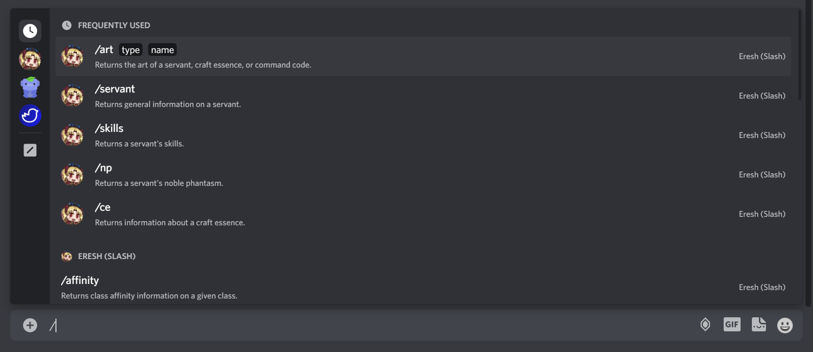

## How To Actually *Use* The Calculation Command
Like EreshBot's other commands, the calculation command is a slash command.
To utilize slash commands, you'll want to first input the character `/` into your chat box.
When you do this, any and all slash commands available to you from all of the bots in your server
(not just EreshBot!) will appear as a list. You'll know that a command is an EreshBot command if it has the 
 
icon by its name and says `Eresh (Slash)` on the right side. 
 

 
 
After entering `/` into the chat box and pulling up the list of slash commands, you'll want to type out `calc` 
to search for the command in question. Once you find the EreshBot command named `calc`, you'll want to hit your enter
key to select it.
 

 
 
Once you've hit the enter key and selected the `calc` command, a box labeled `string` will appear. This will be where 
you will enter what we call your
 calculation string. This is the text that you use to tell EreshBot what it is you
want to calculate.
 

