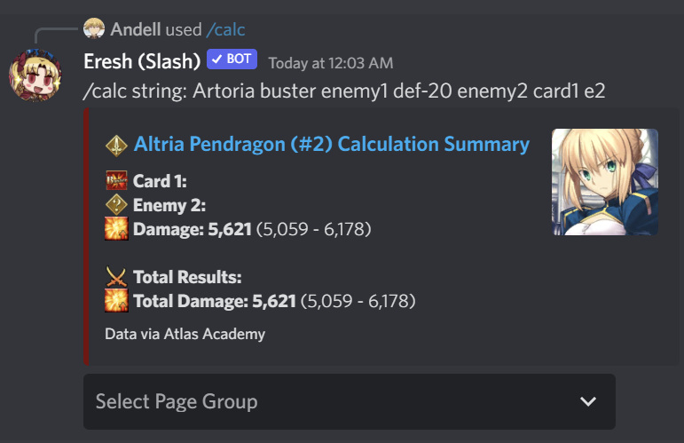

## Basic Input Syntax
The fundamental syntax for a calculation command is as follows:

/calc2 
string: 
servant 
arguments 
 

As you may have seen in the [basics](basics.md) page, once you have selected the 
 /calc2 command, 
the  string: box will automatically appear as well. 
All you will be responsible for typing after you have selected the command are the 
 servant
and the command  arguments.

<h5 style="color:#B70000FF">The Servant Argument</h5>
The servant is technically an argument itself, 
but it is distinct in that it is required. The servant refers to the specific servant who you will be calculating for. 
You will not be able to run the command without providing a servant.

As you will see shortly, arguments are separated by spaces. Since the servant name is technically an argument itself, 
it is no exception. Only the first argument is considered to be the servant, so this means that 

the servant name cannot contain spaces
.
If you need to specify a servant whose name contains a space, such as 
`Arjuna Alter`, you can simply enter it as `ArjunaAlter`.

Please note that the servant name is fuzzy-matched. This basically means that if you give EreshBot a servant it 
doesn't know, it will try to guess who you mean. "Arashkigal" would match to "Ereshkigal" and so on. Aliases can also
be used, such as "Eresh" for "Ereshkigal." Finally, both servant collection numbers (ex. 196) and IDs (ex. 303200) can 
be used.

<h5 style="color:#C97C00FF">The Other Arguments</h5>
After the servant, the rest of the arguments
that you provide, if any, will make up the details of your specific calculation. The documentation goes into more 
detail about what types of arguments there are in the [arguments](./arguments) page, but for the time being, know that:
 
 
A `20% attack buff` would be represented as `a20`.
 
A `50% buster buff` would be represented as `bm50`.

The way to separate multiple arguments is through spaces. So if you wanted to provide both 20% attack and 
50% buster buffs, you would enter `a20 bm50`.

<h5>Basic Input Summary</h5>

With all of that in mind, let's try to put it together. Say you wanted to calculate for 

[Ereshkigal](https://apps.atlasacademy.io/db/JP/servant/196)
with a 20% attack buff and 50% buster buff. How do you think you might do that?

You'd do: 
 /calc2 
 string: 
 Ereshkigal 
 a20 bm50 

## Multi-Calc Input Syntax

Multi-Calcs are an advanced use case. Before diving into them, you should be comfortable with basic
syntax and the default assumptions. It is also helpful but not strictly necessary to be familiar with the argument list.

The servant argument aside, EreshBot calculation arguments can essentially be broken down into three distinct types.

 <ol>
  <li>Arguments used to specify the structure of the calculation, such as the number of 
    enemies or which arguments apply to which enemy. This includes args like <b>enemy</b> and <b>card</b>.</li>
  <li>Arguments used to specify a card or card chain. This includes args like <b>buster</b> and <b>arts</b>.</li>
  <li>Arguments used to specify the specifics of your calculation, such as what level the servant is or how much 
buster card bonus they have. This includes args like <b>level</b>, <b>fou</b>, <b>atk</b> and <b>def</b>.</li>
</ol>

This section will focus on how to use the first two types of arguments.
The most important thing to remember when dealing with multi calcs is that 

the order of your arguments matters . If your calculation string includes the `enemy` arg for 
example, arguments that you include after that argument will only be applied to that enemy.

Take the following two calcs for example:
 
 
/calc2 string: Ereshkigal

 enemy1 
 enemy2 
 enemy3 
 hp22050
 
 
/calc2 string: Ereshkigal

hp22050
 enemy1 
 enemy2 
 enemy3
 
In the first calc, only the third enemy would have HP specified. The other enemies would not. But in 
the second calc, all three enemies would have HP specified.

Essentially, arguments like `enemy` do two things. They both **define** the existence of an enemy as well as 
**switch to** it so any arguments that follow it will only be applied to that enemy until a new structure argument is
specified. You can think of arguments like these as changing the scope of any subsequent arguments.

It is also important to consider how arguments interact with other arguments in a different scope.
Take the following two calcs for example:
 
 
/calc2 string: Ereshkigal buster bm50

 card1 bm60 
 
 
/calc2 string: Ereshkigal buster fou1500

 card1 fou2000 
 
In both cases, these are calculating a buster card from Ereshkigal.
In the first case, we have global `bm50` (50% buster mod) and `bm60` specifically for card1. 
In this case, the buster card will have a total of `bm110`, as buster mod applied globally is added to buster mod
applied specifically to card1.

In the second case, we have global `fou1500` as well as `fou2000` specifically for card1.
Although there is a paw argument for calculating fou paws, many people add the extra atk from fou paws by 
using the normal fou argument on a card by card basis. In this case, fou for the second card will **NOT** be 3500.
It will be 2000, because `fou2000` overrides `fou1500` for card1. It does not add together.

In the vast majority of cases, arguments that override rather than sum will go in most to least specific priority.
That is to say, `Enemy > Card > Wave > General`. To check the details for a specific argument, see the arguments page.

For a brief explanation of each structure and card chain argument, see the charts below.

<b>Full List of Structure Arguments</b>
 <table>
  <tr>
    <th>Argument</th>
    <th>Effect</th>
    <th>Example</th>
  </tr>
  <tr>
    <td>card#</td>
    <td>Switches to a card. This arg does not define cards. See card chain arguments.</td>
    <td>card1</td>
  </tr>
  <tr>
    <td>enemy#</td>
    <td>Defines and/or switches to an enemy.</td>
    <td>enemy1</td>
  </tr>
  <tr>
    <td>e#</td>
    <td>Used for targeting enemies with cards.</td>
    <td>e1</td>
  </tr>
  <tr>
    <td>wave#</td>
    <td>Switches to a wave. This arg does not define waves. See nwave.</td>
    <td>wave1</td>
  </tr>
  <tr>
    <td>nwave#, newwave#</td>
    <td>Defines and/or switches to a wave. Also automatically fills the wave.</td>
    <td>nwave1</td>
  </tr>
  <tr>
    <td>w#</td>
    <td>Used for targeting waves with cards.</td>
    <td>w1</td>
  </tr>
  <tr>
    <td>rng#, rand#, random#</td>
    <td>Applies a specified rng to the entire calculation.</td>
    <td>rng1.0</td>
  </tr>
  <tr>
    <td>wavesize#</td>
    <td>Specifies the number of enemies per wave. Used to indicate that waves should 
    have 6 enemies for certain story fights.</td>
    <td>wavesize6</td>
  </tr>
</table>

<b>Full List of Card Chain Arguments</b>
 <table>
  <tr>
    <th>Argument</th>
    <th>Effect</th>
    <th>Example</th>
  </tr>
  <tr>
    <td>b, buster</td>
    <td>Defines a buster card.</td>
    <td>buster</td>
  </tr>
  <tr>
    <td>a, arts</td>
    <td>Defines an arts card.</td>
    <td>arts</td>
  </tr>
  <tr>
    <td>q, quick</td>
    <td>Defines a quick card.</td>
    <td>quick</td>
  </tr>
  <tr>
    <td>e, extra</td>
    <td>Defines an extra card.</td>
    <td>extra</td>
  </tr>
  <tr>
    <td>n, np, noble</td>
    <td>Defines a noble phantasm card.</td>
    <td>noble</td>
  </tr>
  <tr>
    <td>x</td>
    <td>Defines an empty card.</td>
    <td>x</td>
  </tr>
</table>

* Note: Some arguments, such as `np` and `n`, have other functions when supplied with a number (ex `np5`). Make sure
that you do **not** supply a number to use them as a card chain argument.
* For a more in depth explanation of each argument, see  the [arguments](./arguments.md) page.

Below are examples of different calculation commands that illustrate how these structure and card chain args 
come together.

  
<b>Example 1</b>

/calc2 string: Artoria buster
 enemy1 def-20
 enemy2 
 card1 e2
 
 <table>
  <tr>
    <th>Argument</th>
    <th>Effect</th>
  </tr>
  <tr>
    <td style="color: #0083AFFF;font-weight:bold">Artoria</td>
    <td>This indicates that the servant we are calculating for is Artoria.</td>
  </tr>
  <tr>
    <td style="color: #0083AFFF;font-weight:bold">buster</td>
    <td>This sets the card that we are calculating to one of Artoria's buster cards.</td>
  </tr>
  <tr>
    <td style="color: #00A82FFF;font-weight:bold">enemy1</td>
    <td>This specifies that enemy1 exists, and until a new structure arg is provided, all future 
    arguments will apply only to this enemy.</td>
  </tr>
  <tr>
    <td style="color: #00A82FFF;font-weight:bold">def-20</td>
    <td>This applies 20% defense down specifically to enemy1. Any damage dealt to enemy1 will take this debuff 
    into account.</td>
  </tr>
  <tr>
    <td style="color: #B70000FF;font-weight:bold">enemy2</td>
    <td>This specifies that enemy2 exists, and until a new structure arg is provided, all future
    arguments will apply only to this enemy.</td>
  </tr>
  <tr>
    <td style="color: #C97C00FF;font-weight:bold">card1</td>
    <td>Switches to card1. Until a new structure arg is provided, all future 
    args will apply to card1, which in this case is the buster card specified earlier.</td>
  </tr>
  <tr>
    <td style="color: #C97C00FF;font-weight:bold">e2</td>
    <td>Sets enemy2 as the target of card1. This means that card1 will only hit enemy2.</td>
  </tr>
</table>
In summary, this calculation will hit enemy2 with a buster card from Artoria. Enemy1 will have 20% def down, but 
they won't end up being hit, as our card specifies enemy2 as the target.
 

  
<b>Example 2</b>

/calc2 string: Artoria bnpae 
 nwave1
 card3 e3
 card4 e3
 
 <table>
  <tr>
    <th>Argument</th>
    <th>Effect</th>
  </tr>
  <tr>
    <td style="color: #0083AFFF;font-weight:bold">Artoria</td>
    <td>This indicates that the servant we are calculating for is Artoria.</td>
  </tr>
  <tr>
    <td style="color: #0083AFFF;font-weight:bold">bnpae</td>
    <td>This is a string of card chain arguments. 
    It is equivalent to specifying buster noble arts extra. These will be the cards
    that will be calculated.
    </td>
  </tr>
  <tr>
    <td style="color: #00A82FFF;font-weight:bold">nwave1</td>
    <td>This specifies and switches to full wave 1. It's equivalent to specifying 
    enemy1 enemy2 enemy3 wave1. It creates enemies to fill up the wave,  then
    switches to wave1 so that all future args will be applied only to wave1 until a
    new structure arg is provided.
    </td>
  </tr>
  <tr>
    <td style="color: #B70000FF;font-weight:bold">card3</td>
    <td>Switches to card3. Until a new structure arg is provided, all future 
    args will apply to card3, which in this case is the arts card.
    </td>
  </tr>
  <tr>
    <td style="color: #B70000FF;font-weight:bold">e3</td>
    <td>Sets enemy3 as the target of card1. This means that card3 will only hit enemy3.</td>
  </tr>
  <tr>
    <td style="color: #C97C00FF;font-weight:bold">card4</td>
    <td>Switches to card4. Until a new structure arg is provided, all future 
    args will apply to card4, which in this case is the arts card.
    </td>
  </tr>
  <tr>
    <td style="color: #C97C00FF;font-weight:bold">e3</td>
    <td>Sets enemy3 as the target of card1. This means that card4 will only hit enemy3.</td>
  </tr>
</table>
In summary, this calculation has four cards (bnpae) and three enemies (nwave1).
 <ol>
  <li>The first card is buster, and since no target is specified, will hit enemy1.</li>
  <li>The second card is a noble phantasm. No target is specified, and Artoria's noble phantasm
    is an AoE noble phantasm that hits all enemies. So it will hit all enemies in the wave.</li>
  <li>The third card is an arts card. For card 3, e3 was specified. So it will hit enemy3.</li>
  <li>Finally, the fourth card is an extra card. For card 4, e3 was specified. So it will hit enemy3.</li>
</ol>

  
<b>Example 3 (Advanced)</b>

This time, we're going to simulate a three turn comp on the
<a href="https://apps.atlasacademy.io/db/NA/quest/94031329/1/">Christmas 2020 Lotto Node</a>.

In particular, we'll be simulating the NP4 variant of the Double Skadi + Lancelot Comp
<a href="https://docs.google.com/spreadsheets/d/e/2PACX-1vRlsfhYFXrPzhtbR7LGsn8cXR388SBf0hgnhpq9EH3PR5f1jn4i2rjWyicx0mE63v1DDqZwGOaNAFoW/pubhtml#">provided by XZero and SaberofAvalon</a>.

(Note: The minor discrepancy in max damage is due to the sheet using 1.1x for max RNG, instead 
of the actual max of 1.099x that EreshBot uses.)
  
A calculation string for a full run like this is long and complex. To help make it a bit simpler, you'll want to make 
as much use of argument scope as you can.
For example, we know that all the ghosts here are sky attribute. The only enemies that aren't sky are 
the Chimera and Moriarty himself. You <i>could</i> apply the attribute to each enemy individually, but a 
better way to do this would be to apply sky globally and override it on the Chimera and Moriarty.
  

With that in mind, let's take a look at the calc string for this.
Note that as this is the advanced example, I'm going to skip over some of the repetitive enemy# hp#
arguments, as you should know what those are doing. Skips will be indicated by
 . . . 
 
 

 /calc2 string: Lancelot npnpnp np4 sscope xss archer sky
 enemy1 hp32149
 enemy2 hp32739
 enemy3 hp31560
 enemy4 earth hp104814
 enemy5 hp38586
 enemy6 hp37927
 enemy7 hp45511
 enemy8 man hp180792
 enemy9 hp44771
 card1 w1 a10 ng50 fr50
 card2 w2 a20 ng100 d-30 fr50
 card3 w3 n50 a30 d-30
 <table>
  <tr>
    <th>Argument</th>
    <th>Effect</th>
  </tr>
  <tr>
    <td style="color: #0083AFFF;font-weight:bold">Lancelot</td>
    <td>This indicates that the servant we are calculating for is Lancelot.</td>
  </tr>
  <tr>
    <td style="color: #0083AFFF;font-weight:bold">npnpnp</td>
    <td>This indicates that we will be simulating three uses of Lancelot's Noble Phantasm.</td>
  </tr>
  <tr>
    <td style="color: #0083AFFF;font-weight:bold">np4</td>
    <td>This means that the Lancelot we are calculating for is NP Level 4. Take note 
    of the difference between the np arg with and without a number.</td>
  </tr>
  <tr>
    <td style="color: #0083AFFF;font-weight:bold">sscope</td>
    <td>Dedicated arg for level 100 Kaleidoscope. It's equivalent to ce2000.</td>
  </tr>
  <tr>
    <td style="color: #0083AFFF;font-weight:bold">xss</td>
    <td>Globally specify double Skadi buffs without def down. It's equivalent to 
    writing qm100 qcd200.</td>
  </tr>
  <tr>
    <td style="color: #0083AFFF;font-weight:bold">archer</td>
    <td>Globally specifies all enemies as archers. This could be overridden on an enemy, wave, 
    or card basis if needed, but in this case it's fine.</td>
  </tr>
  <tr>
    <td style="color: #0083AFFF;font-weight:bold">sky</td>
    <td>Globally specifies all enemies as sky attribute. The Chimera and Moriarty are not sky, 
    so we will override them separately, but all other enemies are sky, so it is convenient to 
    specify it globally.</td>
  </tr>
  <tr>
    <td style="color: #00a82f;font-weight:bold">enemy1</td>
    <td>This specifies that enemy1 exists, and until a new structure arg is provided, all future 
    arguments will apply only to this enemy.</td>
  </tr>
  <tr>
    <td style="color: #00a82f;font-weight:bold">hp32149</td>
    <td>This indicates that enemy1 has 32,149 HP. It is necessary to specify HP for 
    refund or stargen to be calculated on any give enemy.</td>
  </tr>
  <tr>
    <td style="color: #b70000;font-weight:bold">. . .</td>
    <td></td>
  </tr>
  <tr>
    <td style="color: #b858fc;font-weight:bold">enemy4</td>
    <td>This specifies that enemy4 exists, and until a new structure arg is provided, all future 
    arguments will apply only to this enemy.</td>
  </tr>
  <tr>
    <td style="color: #b858fc;font-weight:bold">earth</td>
    <td>This specifies that enemy4 should be earth attribute. We set the sky attribute 
    globally, but providing an enemy specific attribute to enemy4 will override the global one 
    for the specific enemy.</td>
  </tr>
  <tr>
    <td style="color: #b858fc;font-weight:bold">hp104814</td>
    <td>This indicates that enemy4 has 104,814 HP. It is necessary to specify HP for 
    refund or stargen to be calculated on any give enemy.</td>
  </tr>
  <tr>
    <td style="color: #b70000;font-weight:bold">. . .</td>
    <td></td>
  </tr>
  <tr>
    <td style="color: #4aadad;font-weight:bold">enemy8</td>
    <td>This specifies that enemy8 exists, and until a new structure arg is provided, all future 
    arguments will apply only to this enemy.</td>
  </tr>
  <tr>
    <td style="color: #4aadad;font-weight:bold">man</td>
    <td>This specifies that enemy8 should be man attribute. We set the sky attribute 
    globally, but providing an enemy specific attribute to enemy4 will override the global one 
    for the specific enemy.</td>
  </tr>
  <tr>
    <td style="color: #4aadad;font-weight:bold">hp180792</td>
    <td>This indicates that enemy4 has 180,792 HP. It is necessary to specify HP for 
    refund or stargen to be calculated on any give enemy.</td>
  </tr>
  <tr>
    <td style="color: #000000;font-weight:bold">card1</td>
    <td>Switches to card1. Until a new structure arg is provided, all future 
    args will apply only to card1. In this case, card1 is Lancelot's first NP.</td>
  </tr>
  <tr>
    <td style="color: #000000;font-weight:bold">w1</td>
    <td>Sets wave1 as the target of card1. This means that card1 will hit wave1. By 
    default, wavesize is 3. 9 enemies were specified, so that means the targets here 
    are enemies 1-3.</td>
  </tr>
  <tr>
    <td style="color: #000000;font-weight:bold">a10</td>
    <td>This gives card1 a 10% attack buff. This is the atk buff on Lancelot's NP.</td>
  </tr>
  <tr>
    <td style="color: #000000;font-weight:bold">ng50</td>
    <td>This gives card1 a 50% np gain buff. This is the np gain buff on the 2004 Mystic Code.</td>
  </tr>
  <tr>
    <td style="color: #000000;font-weight:bold">fr50</td>
    <td>This adds 50% refund to card1. We know that we'll be giving Lancelot one of the Skadis' 50% batteries 
    when the next turn begins, so adding that here can help visualize if we will have 100%+ np gauge after this turn 
    in order to NP next turn.</td>
  </tr>
  <tr>
    <td style="color: #3f831d;font-weight:bold">card2</td>
    <td>Switches to card2. Until a new structure arg is provided, all future 
    args will apply only to card2. In this case, card2 is Lancelot's second NP.</td>
  </tr>
  <tr>
    <td style="color: #3f831d;font-weight:bold">w2</td>
    <td>Sets wave2 as the target of card2. This means that card2 will hit wave2. By 
    default, wavesize is 3. 9 enemies were specified, so that means the targets here 
    are enemies 4-6.</td>
  </tr>
  <tr>
    <td style="color: #3f831d;font-weight:bold">a20</td>
    <td>This gives card2 a 20% attack buff. This is the atk buff on Lancelot's NP. It lasts 
    3 turns and is 10% each time, so our second turn will get 10% from the first NP and 10% 
    from the second.</td>
  </tr>
  <tr>
    <td style="color: #3f831d;font-weight:bold">ng100</td>
    <td>This gives card2 a 100% np gain buff. This is the np gain buff on Lancelot's third skill.</td>
  </tr>
  <tr>
    <td style="color: #3f831d;font-weight:bold">d-30</td>
    <td>This adds 30% defense down to card2. We could also apply this to wave2 via the 
    wave arg, but we know that card2 will hit all enemies in wave2, so it's fine to just 
    apply the 30% def down to the card itself.</td>
  </tr>
  <tr>
    <td style="color: #3f831d;font-weight:bold">fr50</td>
    <td>This adds 50% refund to card2. We know that we'll be giving Lancelot one of the Skadis' 50% batteries 
    when the next turn begins, so adding that here can help visualize if we will have 100%+ np gauge after this turn 
    in order to NP next turn.</td>
  </tr>
  <tr>
    <td style="color: #ff6f00;font-weight:bold">card3</td>
    <td>Switches to card3. Until a new structure arg is provided, all future 
    args will apply only to card3. In this case, card3 is Lancelot's third NP.</td>
  </tr>
  <tr>
    <td style="color: #ff6f00;font-weight:bold">w3</td>
    <td>Sets wave3 as the target of card3. This means that card2 will hit wave3. By 
    default, wavesize is 3. 9 enemies were specified, so that means the target here 
    is enemies 7-9.</td>
  </tr>
  <tr>
    <td style="color: #ff6f00;font-weight:bold">a30</td>
    <td>This gives card3 a 30% attack buff. This is the atk buff on Lancelot's NP. It lasts 
    3 turns and is 10% each time, so our third turn will get 10% from the first NP, 10% 
    from the second, and 10% from the third.</td>
  </tr>
  <tr>
    <td style="color: #ff6f00;font-weight:bold">d-30</td>
    <td>This adds 30% defense down to card3. We could also apply this to wave3 via the 
    wave arg, but we know that card3 will hit all enemies in wave3, so it's fine to just 
    apply the 30% def down to the card itself.</td>
  </tr>
</table>
 

